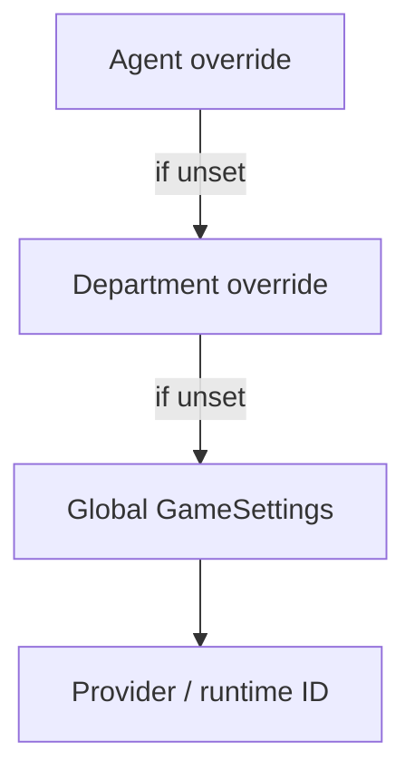

# Agent Runtime & Universal Brain

**Last updated: July 2026**

## Overview

**Agent Brains** (CEO step 6) configures how each employee thinks and executes work. The **brain** module resolves AI providers and runtime backends through a cascade (agent → department → global). The **agent_runtime** module executes tasks via in-app LLM or external subprocess runtimes (e.g. OpenClaw).

---

## Implemented

| Feature | Status | Key paths |
|---------|--------|-----------|
| Provider resolution cascade | ✅ | `brain/resolver.rs` |
| Meeting vs execution providers | ✅ | `resolve_meeting_provider`, `resolve_execution_runtime` |
| Runtime catalog | ✅ | `agent_runtime/registry.rs` |
| LLM-only mode | ✅ | `AgentRuntimeMode::LlmOnly` |
| Subprocess mode | ✅ | `AgentRuntimeMode::Subprocess`, OpenClaw adapter |
| Runtime probe / test | ✅ | `probe_all_agent_runtimes`, `test_agent_runtime` |
| Per-agent runtime override | ✅ | `update_agent_runtime_mode` |
| Per-department runtime override | ✅ | `update_department_runtime_mode` |
| Agent tools (workspace) | ✅ | `scrum/agent_tools.rs`, `scrum_use_agent_tools` |
| SOUL.md load/save | ✅ | `load_agent_soul`, `update_agent_soul` |
| AI provider per agent/dept | ✅ | `update_agent_ai_provider`, `update_department_ai_provider` |
| Brain resolution preview | ✅ | `get_brain_resolution_preview` |
| Frontend Agents page | ✅ | `AgentsPage.tsx`, `AgentsPanel.tsx` |
| OpenClaw status | ✅ | `get_openclaw_status`, `test_openclaw_runtime` |
| Activity context on execute | ✅ | `ActivityRunContext` → Observatory |

---

## Architecture

### Resolution order

`BrainLayer` enum labels which level won for UI display.

### Runtime modes

| Mode | When | Execution path |
|------|------|----------------|
| LLM-only | Default cloud/local model | `ai/` provider call |
| Subprocess | OpenClaw etc. | `agent_runtime/adapters` spawn CLI |
| LLM + tools | `scrum_use_agent_tools` | `agent_workspace_*` commands in loop |

### Supported meeting providers

Resolved via `supported_meeting_provider_ids()` — includes Ollama, hub, and registry-mapped cloud IDs (`brain/resolver.rs`).

### Key commands

| Command | Purpose |
|---------|---------|
| `get_agent_runtime_catalog` | Available backends for UI |
| `get_agent_runtime_status` | Per-agent effective runtime |
| `get_brain_resolution_preview` | Show cascade result before save |
| `update_agent_soul` | Edit SOUL.md personality |

### Security

`agent_runtime/security.rs` constrains subprocess arguments and workspace paths for external runtimes.

### CLI prompt delivery (file-first)

All **subprocess** execution adapters materialize the task prompt to a temp file under
`$TMPDIR/soulcorp-cli-{runtime}-{uuid}/prompt.md` **before** spawn. The full prompt body is
**never** placed on argv (avoids ARG_MAX and quoting issues).

| Adapter | Delivery |
|---------|----------|
| `grok_headless` | `--prompt-file <path>` |
| `claw_agent_cli` | `--message-file <path>` (+ soul.md in same dir) |
| `aider_message` | `--message-file <path>` |
| `prompt_flag` | `--prompt-file <path>` |
| `codex_noninteractive` / `legacy_stdin` | File written; body via **stdin** |

Shared helper: `agent_runtime/prompt_file.rs` (`PromptFile` + `PromptDelivery`).  
Debug: set `SOULCORP_KEEP_CLI_PROMPTS=1` to retain temp dirs after the run.

View CLI input shows a file-based command template (`$PROMPT_FILE`) plus the prompt body.

---

## Planned / Gaps

| Item | Notes |
|------|-------|
| Docker-isolated agent sandboxes | Subprocess only; no container manager |
| Custom runtime plugins | Fixed adapter set |
| Per-task runtime override | Agent/dept/global only |
| Model fine-tune UI | Provider selection only |
| Persist exact spawn-time `cli_prompt_path` on every run | Template path in UI today |

---

## Related docs

- [AGENT_SYSTEM.md](AGENT_SYSTEM.md)
- [AGENT_SKILLS.md](AGENT_SKILLS.md) — capability packs (search, media, browser)
- [OBSERVATORY.md](OBSERVATORY.md)
- [PROJECTS_SCRUM.md](PROJECTS_SCRUM.md)
- [WORKSPACE_FOLDERS_TECH_SPEC.md](WORKSPACE_FOLDERS_TECH_SPEC.md)