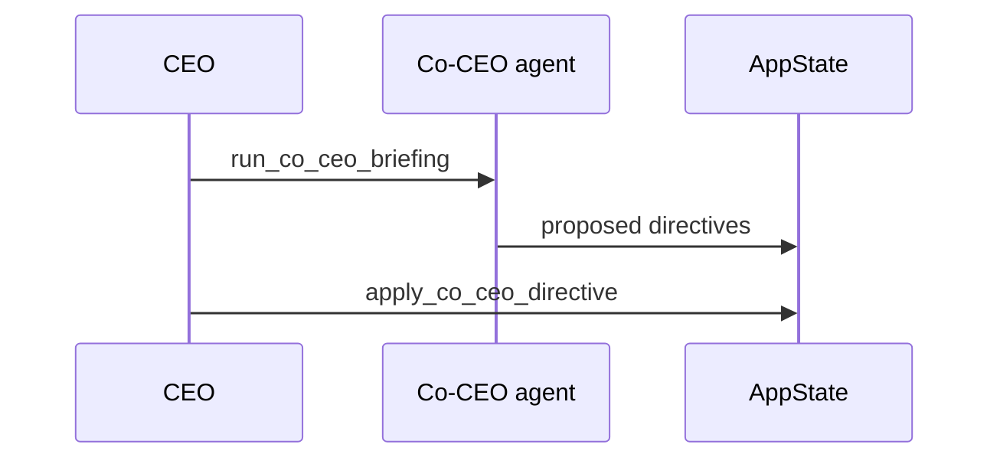

# Agent System

**Last updated: July 2026**

## Overview

Agents are AI employees defined by **SOUL.md** personality files, department assignment, morale/energy stats, and configurable brain/runtime settings. The player hires agents through recruitment; no demo agents are seeded at startup. **AI Co-CEO** (VIP) can spawn briefings and directives with configurable autonomy.

---

## Implemented

| Feature | Status | Key paths |
|---------|--------|-----------|
| Agent roster in AppState | ✅ | `state/agent_roster.rs` |
| SOUL.md load/update | ✅ | `soul/`, `load_agent_soul`, `update_agent_soul` |
| Department assignment | ✅ | `departments/`, `assign_agent_department` |
| Org chart | ✅ | `get_org_chart`, `DepartmentsPage.tsx` |
| Morale / energy / status | ✅ | Simulation tick, `run_simulation_tick` |
| Brain provider per agent/dept | ✅ | `brain/resolver.rs` |
| Runtime mode per agent/dept | ✅ | `update_agent_runtime_mode` |
| Co-CEO spawn + briefing | ✅ | `spawn_co_ceo`, `run_co_ceo_briefing` |
| Co-CEO directives | ✅ | `apply_co_ceo_directive`, `send_co_ceo_directive_to_state` |
| Co-CEO autonomy setting | ✅ | `set_co_ceo_autonomy` |
| Custom VIP departments | ✅ | `create_custom_department` |
| Department cascade AI | ✅ | `departments/cascade.rs` |
| System agents (Fate) | ✅ | `fate/mod.rs`, `FATE_AGENT_ID` |
| Relationship graph | ✅ | `get_agent_relationship_graph` |
| Agent visual customization | ✅ | `update_agent_visual` |
| Frontend Agents page | ✅ | `AgentsPage.tsx` (CEO step 6) |

---

## Architecture

### Agent record (conceptual)

| Field | Role |
|-------|------|
| `id`, `name`, `role` | Identity |
| `department` | Org + brain cascade |
| `morale`, `energy` | Simulation stats |
| `salary` | Monthly payroll (token economy) |
| `status` | `idle`, `working`, `meeting`, `throttled`, … |
| `soul_path` | SOUL.md on disk |

### Department → workspace sync

Hiring or org changes call `sync_workspace_organization_cmd` to mirror department folders under the company workspace.

### Co-CEO flow

### Fate system agent

`FATE_AGENT_ID` drives random events when `play_mode == Game` and `random_events_enabled`. Disabled automatically in Serious Work Mode.

---

## Planned / Gaps

| Item | Notes |
|------|-------|
| Agent skill trees / leveling | Morale and salary only |
| Multi-language SOUL templates | User-authored markdown |
| Agent-to-agent chat outside meetings | Meetings + relationship graph only |
| Avatar generation from SOUL | Manual visual picker |

---

## Related docs

- [AGENT_RUNTIME.md](AGENT_RUNTIME.md)
- [RECRUITMENT_HR.md](RECRUITMENT_HR.md)
- [MEETING_SYSTEM.md](MEETING_SYSTEM.md)
- [WORKSPACE_FOLDERS_SYSTEM.md](WORKSPACE_FOLDERS_SYSTEM.md)