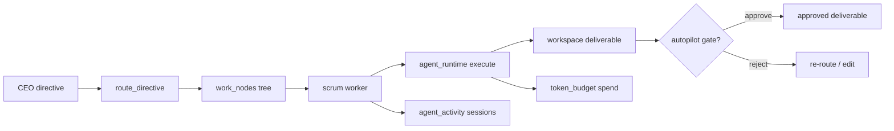

# SoulCorp High-Level Architecture

**Last updated: July 2026**

## Overview

SoulCorp is a **local-first** CEO simulation desktop app. The Tauri client runs the full company loop offline: plan projects, hold LLM meetings, review workspace output, manage org and hiring, configure agent brains, observe live execution, allocate token budgets, and optionally sell work via the marketplace.

Optional **soulmd-hub** integration adds marketplace gigs, NEAR wallet upgrades, and cloud sync. Nothing in the core loop requires network access.

---

## Implemented

| Area | Status | Key paths |
|------|--------|-----------|
| Tauri 2 desktop shell | ✅ | `soulcorp-desktop/src-tauri/`, `src/App.tsx` |
| Game state (SQLite) | ✅ | `src-tauri/src/db/`, `state/mod.rs` |
| CEO 9-step workflow UI | ✅ | `src/config/navigation.ts`, ribbon in `App.tsx` |
| Projects / Scrum pipeline | ✅ | `src-tauri/src/scrum/`, `ProjectsPage.tsx` |
| Company Autopilot | ✅ | `src-tauri/src/autopilot/`, `AutopilotPipelinePanel.tsx` |
| LLM meetings | ✅ | `src-tauri/src/meeting/`, `MeetingPage.tsx` |
| Notion-like workspace | ✅ | `src-tauri/src/workspace/`, `WorkspaceShell` |
| Agent workspace API | ✅ | `agent_workspace_*` commands in `lib.rs` |
| Token economy | ✅ | `src-tauri/src/token_budget/`, `TokensPage.tsx` |
| Agent runtime / brain | ✅ | `agent_runtime/`, `brain/`, `AgentsPage.tsx` |
| Observatory (live minds) | ✅ | `agent_activity/`, `ObservatoryPage.tsx` |
| Recruitment + org sync | ✅ | `commands/recruitment.rs`, `sync_workspace_organization_cmd` |
| Hub gigs (optional) | ✅ | `gigs/`, `hub/`, `MarketplacePage.tsx` |
| Performance layer | ✅ | `PanelHost.tsx`, `lazyPanels.ts`, async workspace cmds |
| Product editions v1 / v2 | ✅ | `PRODUCT_EDITION` env, `config/features.ts` |

---

## Architecture

### System diagram

```
┌──────────────────────────────────────────────────────────────────┐
│                     React 19 + Vite Frontend                      │
│  PanelHost (lazy LRU 6) │ Three.js campus │ TipTap workspace     │
│  CEO ribbon (9 steps)   │ Observatory     │ Command Center       │
└───────────────────────────────┬──────────────────────────────────┘
                                │ Tauri invoke
┌───────────────────────────────▼──────────────────────────────────┐
│                      Rust Backend (Tauri 2)                       │
│ ┌─────────────┐ ┌──────────────┐ ┌────────────┐ ┌─────────────┐ │
│ │ scrum       │ │ autopilot    │ │ meeting    │ │ workspace   │ │
│ │ orchestrator│ │ token_budget │ │ agent_run  │ │ brain/ai    │ │
│ └─────────────┘ └──────────────┘ └────────────┘ └─────────────┘ │
│ ┌─────────────┐ ┌──────────────┐ ┌────────────┐ ┌─────────────┐ │
│ │ finance     │ │ recruitment  │ │ gigs/hub   │ │ achievements│ │
│ └─────────────┘ └──────────────┘ └────────────┘ └─────────────┘ │
│         rusqlite (game state)  +  filesystem (workspace pages)    │
└───────────────────────────────┬──────────────────────────────────┘
                                │ optional HTTPS
┌───────────────────────────────▼──────────────────────────────────┐
│              soulmd-hub (PHP + MySQL + NEAR) — optional           │
└──────────────────────────────────────────────────────────────────┘
```

### CEO workflow (implemented)

Defined in `CEO_WORKFLOW_CHAIN`:

1. **Projects** — directives, sprints, work tree, execution runs
2. **Meeting** — align team via observable LLM meeting
3. **Workspace** — review pages, deliverables, briefs
4. **Departments** — org chart, runtime overrides per dept
5. **Recruitment** — hire candidates, sync org folders
6. **Agent Brains** — SOUL.md, provider, runtime mode (LLM vs subprocess)
7. **Observatory** — live agent sessions, tool calls, activity feed
8. **Tokens** — company pool, dept/agent wallets, usage ledger
9. **Marketplace** — hub gigs, QC, payouts

Autopilot (`autopilot/`) orchestrates steps 1–3 with configurable human gates; see [COMPANY_AUTOPILOT.md](COMPANY_AUTOPILOT.md).

### Rust module map

| Module | Role |
|--------|------|
| `scrum` | Work nodes, directives, sprints, parallel executor, worker loop |
| `autopilot` | Snapshot phases, intervention gates, brief page bootstrap |
| `orchestrator` | Cross-system automation (meetings, routing) |
| `meeting` | Multi-turn LLM meetings with token costing |
| `workspace` | Pages, folders, FTS, cache, agent tools |
| `agent_runtime` | Pluggable backends (in-app LLM, OpenClaw, etc.) |
| `brain` | Provider/runtime resolution cascade (agent → dept → global) |
| `agent_activity` | Session logging for Observatory |
| `token_budget` | Wallets, periods, spend tracking, rebalance |
| `operations` | V1 readiness, auto-recruit, normalization |

### Data flow (typical work cycle)



### Frontend performance (implemented)

- All major panels loaded via `React.lazy` (`config/lazyPanels.ts`)
- `PanelHost` keeps up to 6 visited panels mounted (LRU eviction)
- Workspace commands use `tokio::spawn_blocking` + snapshot cache
- WebGL scene pauses when office panel is inactive
- Vite `manualChunks` splits vendor / three / tiptap bundles

See [PERFORMANCE.md](PERFORMANCE.md).

---

## Planned / Gaps

| Item | Notes |
|------|-------|
| Full hub marketplace parity | Desktop client complete; hub PHP endpoints partially stubbed |
| Multi-company portfolio UI | Data model supports multiple companies; UX is basic switcher |
| Real-time hub WebSocket | Polling/sync only today |
| Cloud workspace sync | Local-first only; export ZIP / backup JSON |
| Mobile / web-only edition | `dev:web` exists for UI dev; not a shipped product |

---

## Related docs

- [TECH_STACK_FINAL.md](TECH_STACK_FINAL.md)
- [TAURI_DESKTOP_SPEC.md](TAURI_DESKTOP_SPEC.md)
- [COMPANY_AUTOPILOT.md](COMPANY_AUTOPILOT.md)
- [PROJECTS_SCRUM.md](PROJECTS_SCRUM.md)
- [DEVELOPMENT_ROADMAP.md](DEVELOPMENT_ROADMAP.md)