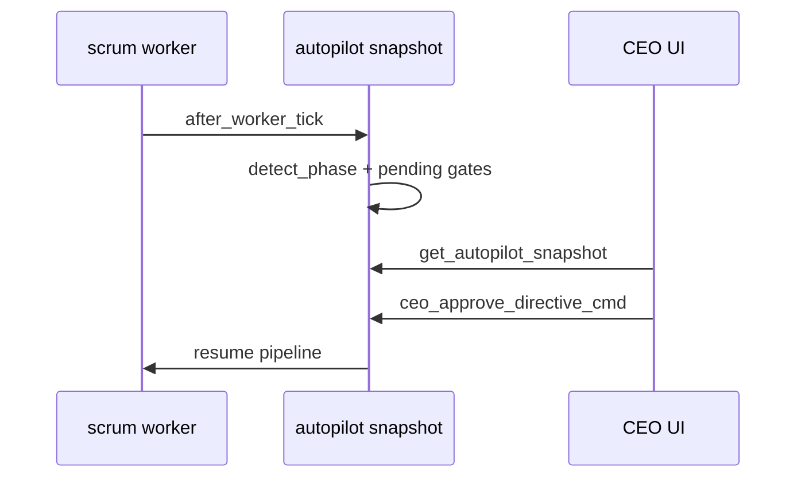

# Company Autopilot

**Last updated: July 2026**

## Overview

Company Autopilot runs the full CEO work cycle with minimal manual input: bootstrap directives, align in meetings, plan sprints, document briefs, schedule execution, run agent work, and review deliverables. **Human-in-the-loop gates** let the CEO approve or reject directives, deliverables, meeting summaries, and story briefs before the pipeline continues.

---

## Implemented

| Feature | Status | Key paths |
|---------|--------|-----------|
| Autopilot snapshot + phases | ✅ | `autopilot/snapshot.rs` |
| Pipeline step counts | ✅ | `AutopilotPipelineStep`, `AutopilotPhaseCounts` |
| Phase detection | ✅ | `detect_phase()` — Bootstrap → … → Stalled |
| Full autopilot toggle | ✅ | `set_full_autopilot`, `apply_full_autopilot_settings` |
| Intervention modes | ✅ | `gate_directives`, `gate_deliverables`, `paused` |
| CEO approve/reject/edit | ✅ | `autopilot/interventions.rs` |
| Meeting gate dismiss | ✅ | `dismiss_meeting_gate_cmd` |
| Brief page bootstrap | ✅ | `autopilot/brief_pages.rs` |
| First-cycle bootstrap | ✅ | `autopilot/bootstrap.rs` |
| Worker tick hook | ✅ | `after_worker_tick()` in snapshot |
| Frontend pipeline panel | ✅ | `AutopilotPipelinePanel.tsx` |
| Snapshot hook + client | ✅ | `useAutopilotSnapshot.ts`, `autopilotClient.ts` |
| Command Center integration | ✅ | Projects page overview + autopilot drawer |
| Smoke tests | ✅ | `autopilot/smoke_test.rs` |

---

## Architecture

### Autopilot phases

| Phase | Meaning |
|-------|---------|
| `bootstrap` | No active work yet; needs first directive |
| `briefing` | Open directives awaiting routing |
| `aligning` | Meeting or alignment in progress |
| `planning` | Stories/tasks being structured |
| `documenting` | Story brief pages missing in workspace |
| `scheduling` | Tasks unassigned or sprint not started |
| `executing` | Active execution runs |
| `reviewing` | Deliverables in review / gated |
| `delivered` | Cycle complete for current batch |
| `growing` | Expansion / marketplace follow-up |
| `stalled` | No progress for `STALL_TICK_THRESHOLD` worker ticks |

### Gate kinds (`PendingGateKind`)

- **Directive** — CEO must approve routed directive
- **Deliverable** — CEO must approve agent output
- **MeetingSummary** — CEO reviews meeting outcome
- **StoryBrief** — CEO edits story acceptance criteria

### Settings toggles (full autopilot enables)

When `autopilot_full_auto_enabled`:

- `scrum_worker_enabled`, `orchestrator_enabled`
- `scrum_auto_route`, `scrum_auto_schedule`, `scrum_auto_execute`, `scrum_auto_approve`
- `scrum_auto_retry_blocked`, `orchestrator_auto_meeting`
- Parallel agents when staffed ≥ 2 and token pool ≥ `scrum_min_tokens_guard`

### Data flow

### Key commands

| Command | Purpose |
|---------|---------|
| `get_autopilot_snapshot` | Full pipeline state for UI |
| `set_autopilot_intervention_mode` | Gate mode selection |
| `set_full_autopilot` / `pause_autopilot` / `resume_autopilot` | Run control |
| `ceo_approve_directive_cmd` / `ceo_reject_directive_cmd` | Directive gates |
| `ceo_approve_deliverable_cmd` / `ceo_reject_deliverable_cmd` | Output gates |
| `ceo_edit_directive_cmd` / `ceo_update_story_criteria_cmd` | In-place edits |
| `ceo_reroute_story_cmd` | Reassign blocked work |

---

## Planned / Gaps

| Item | Notes |
|------|-------|
| Autopilot analytics dashboard | Snapshot only; no historical trend charts |
| Per-project autopilot profiles | Global settings today |
| Email/notification gates | In-app gates only |
| Autopilot replay / audit export | Interventions stored in state; no dedicated export |

---

## Related docs

- [PROJECTS_SCRUM.md](PROJECTS_SCRUM.md)
- [MEETING_SYSTEM.md](MEETING_SYSTEM.md)
- [OBSERVATORY.md](OBSERVATORY.md)
- [ARCHITECTURE_OVERVIEW.md](ARCHITECTURE_OVERVIEW.md)