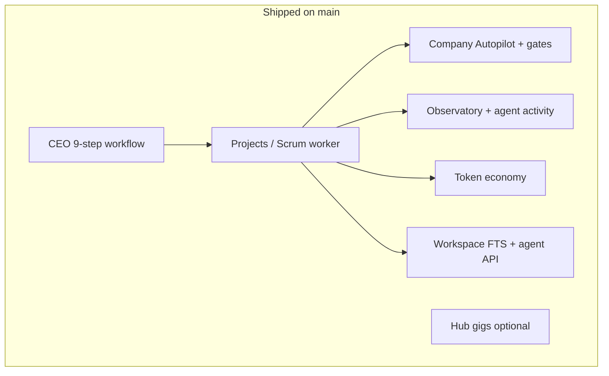

# SoulCorp Development Roadmap

**Last updated: July 2026**

## Overview

Phases **0–22** are **merged at 100%** per `.automation/phase-state.json`. Post-phase work added **Company Autopilot** and a **three-phase performance pass** (lazy panels, async workspace, WebGL pause). This roadmap reflects shipped reality, not aspirational scope.

---

## Guiding principles (still active)

- Desktop must run **fully offline** without soulmd-hub.
- Hub connection is **optional** (marketplace, NEAR upgrades, sync).
- User-created data only — no auto-seeded demo company.
- Visible CEO workflow (9 steps) is the primary v1 UX path.

---

## Phase history (implemented)

| Phase | Focus | Merged | Outcome |
|-------|-------|--------|---------|
| 0 | Project setup | 2026-06-30 | Tauri scaffold, automation, CI |
| 1 | Isometric world | 2026-06-30 | Three.js campus, UI shell |
| 2 | Agent systems | 2026-06-30 | Meetings, events, finance, god mode |
| 3 | Workspace | 2026-06-30 | Notion-like pages, agent folders |
| 4 | Local polish | 2026-06-30 | Achievements, export, offline |
| 5 | Hub integration | 2026-06-30 | Gig client, sync commands |
| 6 | Release | 2026-06-30 | Pro/VIP, E2E, installers |
| 7 | 3D smoke | 2026-06-30 | Headless xvfb pixel test |
| 8 | Render perf | 2026-06-30 | InstancedMesh, LOD sprites |
| 9 | Ship | 2026-06-30 | .deb bundle verification |
| 10 | Gig lifecycle | 2026-06-30 | Accept → work → QC → payout |
| 11 | Onboarding | 2026-06-30 | First-launch wizard |
| 12 | Static site | 2026-06-30 | ZIP + Netlify/Vercel config |
| 13 | Pro/VIP depth | 2026-06-30 | Foresight, morale heatmap, Co-CEO |
| 14 | Gig QC | 2026-06-30 | Submit/reject/dispute, score bands |
| 15 | Recruitment graph | 2026-06-30 | Relationship graph, analytics |
| 16 | LLM meetings | 2026-06-30 | Ollama + hub real meetings |
| 17 | VIP executive | 2026-06-30 | Custom departments, AI Co-CEO |
| 18 | Deploy export | 2026-06-30 | GitHub/Vercel one-click deploy |
| 19 | V1 production | 2026-07-07 | Persistence, observability, auto-recruit |
| 20 | Workspace UX 2.0 | 2026-07-08 | Six-view nav, command palette, pins |
| 21 | Workspace FTS | 2026-07-08 | SQLite FTS5, lazy snapshots, virtualization |
| 22 | Agent workspace API | 2026-07-08 | Agent tools, activity feed, deliverables |

Verify a phase from repo root:

```bash
bash scripts/verify-phase.sh 22
```

---

## Post-phase delivery (2026-07, on `main`)

| Work | Commits | Status |
|------|---------|--------|
| Company Autopilot PR1–5 | `f1b807e`, `6147f2b` | ✅ Merged |
| Perf phase 1 — lazy panels, LRU host, manualChunks | `03fe6c7` | ✅ Merged |
| Perf phase 2 — async workspace, cache, spawn_blocking | `03fe6c7` | ✅ Merged |
| Perf phase 3 — scrum cache, nav prefetch, debounce | `03fe6c7` | ✅ Merged |
| Perf remaining 5% — FileViewer lazy, WebGL pause, org sync | `c316efe` | ✅ Merged |

---

## Current product capabilities



---

## Planned / next (not scheduled)

| Priority | Item | Notes |
|----------|------|-------|
| Medium | Hub PHP endpoint parity | Desktop ready; hub controllers partial |
| Medium | Tauri auto-updater | Distribution convenience |
| Low | Multi-company portfolio dashboard | Data model exists |
| Low | Real-time hub WebSocket | Replace poll-based sync |
| Low | Cloud workspace replication | Conflicts with local-first default |

---

## Related docs

- [INDEX.md](INDEX.md)
- [ARCHITECTURE_OVERVIEW.md](ARCHITECTURE_OVERVIEW.md)
- [COMPANY_AUTOPILOT.md](COMPANY_AUTOPILOT.md)
- [PERFORMANCE.md](PERFORMANCE.md)