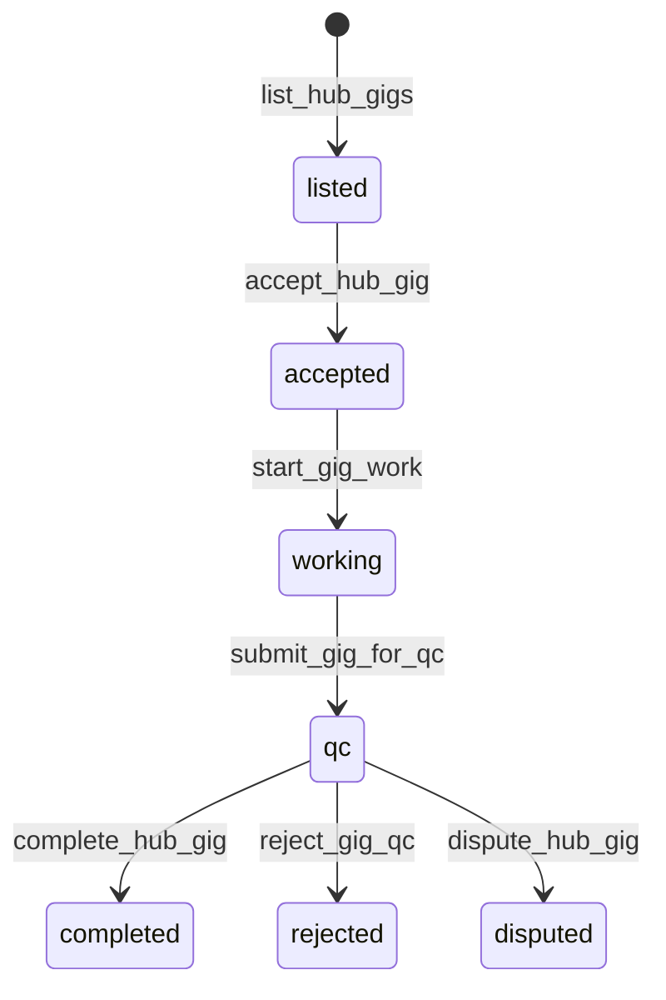

# Export, Deliverables & Marketplace

**Last updated: July 2026**

## Overview

Agents produce **real artifacts**: workspace pages, files, static sites, and QC-rated gig deliverables. The CEO can export company backups, reports, markdown ZIPs, and deploy static sites. **Marketplace** (CEO step 9) connects to soulmd-hub for gig revenue when online.

---

## Implemented

| Feature | Status | Key paths |
|---------|--------|-----------|
| Company backup JSON | ✅ | `export_company_backup`, `import_company_backup` |
| Report MD / HTML / PDF | ✅ | `export_company_report_*`, `report/` |
| Workspace markdown ZIP | ✅ | `export_workspace_markdown_zip` |
| Static site ZIP | ✅ | `export_static_site_zip`, `static_site/` |
| QC-rated deliverables ZIP | ✅ | `export_qc_rated_deliverables_zip` |
| Open exports folder | ✅ | `open_exports_folder` |
| GitHub push deploy | ✅ | `push_static_site_to_github` |
| Vercel deploy | ✅ | `push_static_site_to_vercel` |
| Netlify deploy | ✅ | `push_static_site_to_netlify` |
| Deploy status | ✅ | `get_deploy_status` |
| Hub gig lifecycle | ✅ | accept → work → QC → complete/dispute |
| Link work to gig | ✅ | `link_work_node_to_gig` |
| Marketplace UI | ✅ | `MarketplacePage.tsx` |
| Async export (blocking pool) | ✅ | `spawn_blocking` in `commands/export.rs` |

---

## Architecture

### Gig lifecycle

### Static site pipeline

Workspace pages → `static_site` generator → ZIP with host config → optional one-click push to GitHub/Vercel/Netlify from Settings.

### Deliverable quality

QC bands score agent output before marketplace completion; rated exports bundled via `export_qc_rated_deliverables_zip`.

---

## Planned / Gaps

| Item | Notes |
|------|-------|
| In-app code repo git push | GitHub static site path only |
| Marketplace escrow on-chain | Hub-dependent |
| Auto-list deliverables as gigs | Manual marketplace flow |
| PDF styling templates | Basic printpdf output |

---

## Related docs

- [PROJECTS_SCRUM.md](PROJECTS_SCRUM.md)
- [OFFLINE_FIRST_SYNC.md](OFFLINE_FIRST_SYNC.md)
- [WORKSPACE_FOLDERS_TECH_SPEC.md](WORKSPACE_FOLDERS_TECH_SPEC.md)
- [docs/soulmd-hub/NEW_API_ENDPOINTS_FOR_HUB.md](soulmd-hub/NEW_API_ENDPOINTS_FOR_HUB.md)