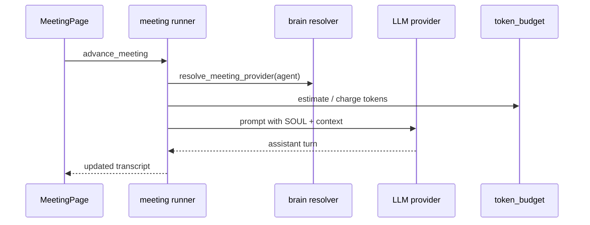

# Meeting System

**Last updated: July 2026**

## Overview

**Meeting** (CEO step 2) runs **fully observable multi-agent LLM conversations**. Each turn calls the resolved meeting provider (Ollama, hub, or cloud). Token costs are estimated before and charged during the meeting. Meetings can feed directives, workspace notes, and autopilot alignment gates.

---

## Implemented

| Feature | Status | Key paths |
|---------|--------|-----------|
| Start / advance meeting | ✅ | `meeting/runner.rs`, `start_meeting`, `advance_meeting` |
| Active meeting state | ✅ | `get_active_meeting` |
| LLM provider integration | ✅ | `ai/`, `brain::resolve_meeting_provider` |
| Streaming responses | ✅ | `ai/streaming.rs` |
| Token cost estimate | ✅ | `estimate_meeting_turn_cost` |
| Token charging | ✅ | `token_budget::charge_tokens` |
| Meeting AI status | ✅ | `get_meeting_ai_status` |
| Generate meeting notes | ✅ | `generate_meeting_notes` → workspace |
| Autopilot meeting gate | ✅ | `dismiss_meeting_gate_cmd`, `PendingGateKind::MeetingSummary` |
| Follow-up directive | ✅ | `meeting_follow_up_directive_cmd` |
| Orchestrator auto-meeting | ✅ | `orchestrator_auto_meeting` setting |
| Frontend Meeting page | ✅ | `MeetingPage.tsx` |
| Async LLM invoke | ✅ | `spawn_blocking` in `commands/meeting.rs` |

---

## Architecture

### Meeting turn flow

### Provider resolution

Uses `resolve_meeting_registry_id` and per-agent/dept overrides before falling back to global `GameSettings`.

### Integration with autopilot

When intervention mode gates meetings, a `MeetingSummary` pending gate blocks pipeline advance until CEO dismisses or acts via `dismiss_meeting_gate_cmd`.

### Serious Work Mode

When `play_mode` is work-focused, random meeting interruptions from Fate are suppressed (see [RANDOM_EVENTS.md](RANDOM_EVENTS.md)).

---

## Planned / Gaps

| Item | Notes |
|------|-------|
| Voice / TTS meetings | Text transcript only |
| Meeting templates library | Ad-hoc topics from UI |
| Calendar-scheduled recurring meetings | Manual start only |
| Multi-room parallel meetings | Single active meeting |

---

## Related docs

- [AGENT_RUNTIME.md](AGENT_RUNTIME.md)
- [COMPANY_AUTOPILOT.md](COMPANY_AUTOPILOT.md)
- [FINANCE_BUDGET.md](FINANCE_BUDGET.md)
- [NOTION_LIKE_SYSTEM.md](NOTION_LIKE_SYSTEM.md)