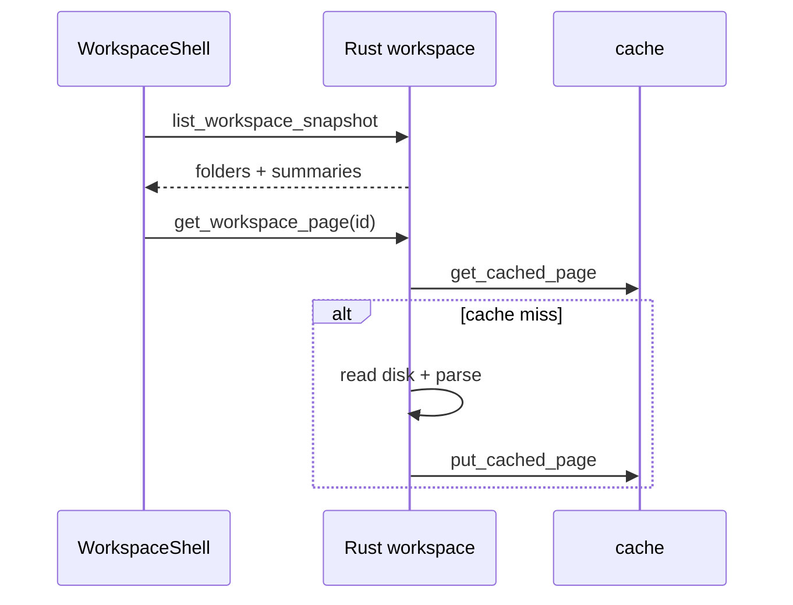

# Workspace UI, Data Model & Sync

**Last updated: July 2026**

## Overview

Workspace data lives in **company-scoped folders** on disk plus a **SQLite FTS5** index for search. The UI loads a compact **snapshot** first, then fetches pages on demand with an in-memory LRU cache. Tauri commands are **async** with `spawn_blocking` for disk I/O.

---

## Implemented

| Feature | Status | Key paths |
|---------|--------|-----------|
| Page + folder model | ✅ | `workspace/models.rs` |
| Filesystem storage | ✅ | `workspace/storage.rs` |
| FTS5 virtual table | ✅ | `workspace/index.rs` — `workspace_fts` |
| Lazy snapshot API | ✅ | `list_workspace_snapshot` |
| Tree / children APIs | ✅ | `list_workspace_tree`, `list_workspace_folder_children` |
| Page LRU cache (64) | ✅ | `workspace/cache.rs` |
| Async command wrappers | ✅ | `commands/workspace.rs` |
| Page CRUD | ✅ | create/update/delete/reorder commands |
| File import | ✅ | `import_workspace_files` |
| Virtualized lists (FE) | ✅ | `@tanstack/react-virtual` in workspace lists |
| Workspace store | ✅ | `stores/workspaceStore.ts` |
| Client service | ✅ | `services/workspaceClient.ts` |

---

## Architecture

### Storage layout

```
{app_data}/workspaces/{company_id}/
├── pages/{page_id}.md
├── meta/{page_id}.json
├── files/...
└── folders.json (tree structure)
```

### Load sequence



### FTS search

`search_workspace` builds an FTS5 `MATCH` query with `snippet()` and `bm25()` ranking. Index updated on page create/update/delete.

### Agent-facing APIs

Separate `agent_workspace_*` commands provide scoped read/write for scrum execution — see [WORKSPACE_FOLDERS_TECH_SPEC.md](WORKSPACE_FOLDERS_TECH_SPEC.md).

---

## Planned / Gaps

| Item | Notes |
|------|-------|
| Cloud sync / CRDT | No multi-device merge |
| WebSocket live index | Local FTS only |
| Binary file full-text | Filename + metadata search |
| External S3 backup | Local export ZIP |

---

## Related docs

- [NOTION_LIKE_SYSTEM.md](NOTION_LIKE_SYSTEM.md)
- [PERFORMANCE.md](PERFORMANCE.md)
- [WORKSPACE_FOLDERS_TECH_SPEC.md](WORKSPACE_FOLDERS_TECH_SPEC.md)