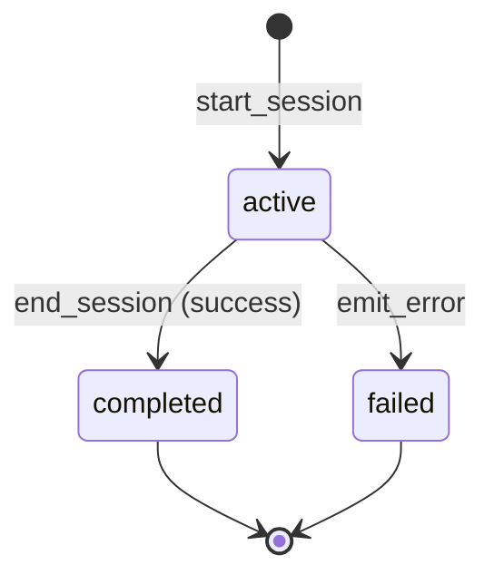

# Observatory — Live Agent Minds

**Last updated: July 2026**

## Overview

Observatory is step **7** in the CEO workflow. It surfaces **live and historical agent activity**: which agents are thinking, what tasks they run, token spend, terminal output, and mind-stream events. Data comes from the Rust `agent_activity` module and is displayed in four sections.

---

## Implemented

| Feature | Status | Key paths |
|---------|--------|-----------|
| Activity sessions | ✅ | `agent_activity/types.rs`, `start_session` / `end_session` |
| Event stream | ✅ | `emit_step_start`, `emit_token_delta`, `emit_terminal_line`, … |
| Tauri snapshot API | ✅ | `list_agent_activity`, `get_agent_session` |
| Frontend store | ✅ | `stores/agentActivityStore.ts` |
| Observatory page (step 7) | ✅ | `ObservatoryPage.tsx` |
| Four UI sections | ✅ | `observatory/ObservatoryPanel.tsx` |
| Live agent grid | ✅ | `AgentLiveGrid.tsx` |
| Activity timeline | ✅ | `ActivityTimeline.tsx` |
| Thought / mind stream | ✅ | `ThoughtStreamPane.tsx` |
| Autopilot phase events | ✅ | `emit_autopilot_phase_change` |
| Acceptance tests | ✅ | `acceptance/observatoryAcceptance.ts` |

---

## Architecture

### UI sections

| Section | ID | Content |
|---------|-----|---------|
| Overview | `overview` | How to use, links to Agents / Projects |
| Live now | `live` | Agents with `status === "active"` sessions |
| History | `history` | Completed sessions timeline |
| Mind stream | `stream` | Token deltas, LLM output, worker messages |

### Session lifecycle

### Event kinds (representative)

| Kind | Source |
|------|--------|
| `step_start` / `step_complete` | Scrum execution steps |
| `token_delta` | `token_budget` spend during run |
| `terminal_line` | Subprocess runtime stdout |
| `worker_message` | Scrum worker diagnostics |
| `autopilot_phase` | Autopilot phase transitions |
| `deliverable_ready` | Workspace deliverable written |

### Brain labels in UI

`resolve_brain_labels` maps agent → department → global provider/runtime for display in session headers.

### Integration points

- **Scrum executor** passes `ActivityRunContext` into `agent_runtime::execute_for_task`
- **Autopilot** emits phase changes visible in mind stream
- **WorkflowNextButton** advances CEO from Observatory → Tokens (step 8)

---

## Planned / Gaps

| Item | Notes |
|------|-------|
| Session export (JSON) | Markdown export via `export_agent_activity_markdown` |
| Filter by department / project | Basic list today |
| Real-time WebSocket to remote observers | Local Tauri events only |
| Session replay with workspace deep links | Partial — deliverable events link when present |

---

## Related docs

- [AGENT_RUNTIME.md](AGENT_RUNTIME.md)
- [AGENT_SYSTEM.md](AGENT_SYSTEM.md)
- [COMPANY_AUTOPILOT.md](COMPANY_AUTOPILOT.md)
- [PROJECTS_SCRUM.md](PROJECTS_SCRUM.md)