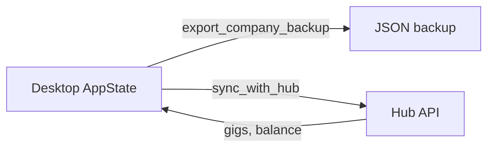

# Offline-First Architecture & Sync

**Last updated: July 2026**

## Overview

SoulCorp desktop is **fully playable offline**. Game state persists to local SQLite; workspace pages live on disk. Hub sync, NEAR upgrades, and marketplace gigs are **opt-in** and degrade gracefully when unreachable.

---

## Implemented

| Feature | Status | Key paths |
|---------|--------|-----------|
| Local SQLite persistence | ✅ | `db/persistence.rs`, `rusqlite` |
| Flush on app exit | ✅ | `lib.rs` `RunEvent::Exit` |
| Multi-company local registry | ✅ | `bootstrap_companies` |
| Workspace filesystem storage | ✅ | `workspace/storage.rs` |
| Company backup export/import | ✅ | `export_company_backup`, `import_company_backup` |
| Hub sync command | ✅ | `sync_with_hub` |
| Hub status + config | ✅ | `get_hub_status`, `update_hub_config` |
| Hub gigs (when online) | ✅ | `gigs/`, `hub/` |
| $SOUL balance fetch | ✅ | `fetch_soul_balance` |
| No startup network requirement | ✅ | App launches without hub |
| V1 operational normalization | ✅ | `operations/normalize_v1_operational_state` |

---

## Architecture

### Data residency

| Data | Location | Sync |
|------|----------|------|
| Agents, scrum, tokens | SQLite | Backup JSON only |
| Workspace pages | Local FS | Export ZIP |
| Hub gigs / tier | Hub MySQL | `sync_with_hub` |
| NEAR wallet | Browser extension | On-demand |

### Sync model

User initiates sync explicitly — no background always-on replication of full game state to cloud.

### Offline gig behavior

Gig list empty or cached when hub unreachable; local scrum and workspace continue unaffected.

---

## Planned / Gaps

| Item | Notes |
|------|-------|
| Automatic scheduled sync | Manual `sync_with_hub` |
| Conflict resolution for multi-device | Single-writer local model |
| WebSocket push from hub | REST only |
| End-to-end encrypted cloud backup | Plain JSON backup today |

---

## Related docs

- [ARCHITECTURE_OVERVIEW.md](ARCHITECTURE_OVERVIEW.md)
- [EXPORT_REAL_PRODUCTS.md](EXPORT_REAL_PRODUCTS.md)
- [docs/soulmd-hub/SOULMD_HUB_EXTENSION_PLAN.md](soulmd-hub/SOULMD_HUB_EXTENSION_PLAN.md)