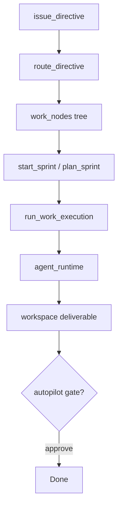

# Projects & Scrum Pipeline

**Last updated: July 2026**

## Overview

**Projects** (CEO step 1) is the command center for company work: directives, work trees, sprints, execution runs, and deliverable approval. A background **scrum worker** advances tasks when automation settings allow. The **orchestrator** can trigger meetings and routing across subsystems.

---

## Implemented

| Feature | Status | Key paths |
|---------|--------|-----------|
| Work tree (epics → stories → tasks) | ✅ | `scrum/types.rs`, `WorkNodeKind` |
| Directives | ✅ | `issue_directive`, `route_directive`, `cancel_directive` |
| Sprint lifecycle | ✅ | `create_sprint`, `start_sprint`, `close_sprint`, `plan_sprint_cmd` |
| Execution runs | ✅ | `run_work_execution`, `run_batch_executions`, `parallel_executor.rs` |
| Background worker | ✅ | `scrum/worker.rs`, spawned in `lib.rs` setup |
| Command center overview | ✅ | `scrum/command_center.rs`, `get_command_center_overview` |
| Directive preview tree | ✅ | `preview_route_directive_cmd` |
| Deliverable approval | ✅ | `approve_deliverable` + CEO autopilot gates |
| Agent tools execution | ✅ | `scrum/agent_tools.rs` when `scrum_use_agent_tools` |
| Gig linking | ✅ | `link_work_node_to_gig` |
| Frontend Projects page | ✅ | `ProjectsPage.tsx`, backlog panels |
| Scrum snapshot cache (FE) | ✅ | `stores/scrumSnapshotCache.ts` |
| Cost estimation | ✅ | `estimate_work_execution_cost`, `estimate_meeting_turn_cost` |

---

## Architecture

### Work node statuses

`WorkNodeStatus`: includes `Todo`, `InProgress`, `Blocked`, `InReview`, `Done` (see `scrum/types.rs`).

### Directive flow

### Command center metrics

`CommandCenterOverview` includes: token pool, monthly burn, payroll, morale/energy averages, open directives, blocked tasks, failed/throttled runs, active sprint burndown, execution pause flag, and alert list.

### Automation settings (representative)

| Setting | Effect |
|---------|--------|
| `scrum_worker_enabled` | Background tick processing |
| `scrum_auto_route` | Auto-route open directives |
| `scrum_auto_schedule` | Auto-assign sprint tasks |
| `scrum_auto_execute` | Auto-start execution runs |
| `scrum_auto_approve` | Auto-approve low-risk deliverables |
| `scrum_parallel_agents` | Parallel executor when staffed + tokens OK |
| `scrum_execution_paused` | Halts worker execution |

### Key commands

| Command | Purpose |
|---------|---------|
| `get_scrum_snapshot` | Full projects state for UI |
| `get_work_tree` | Hierarchical backlog |
| `get_command_center_overview` | Dashboard KPIs |
| `set_default_pm_agent` | Default routing target |
| `list_execution_runs` | Run history |

---

## Planned / Gaps

| Item | Notes |
|------|-------|
| Gantt / calendar views | Backlog tree only |
| Cross-company project portfolio | Single company context |
| External issue tracker sync | No Jira/Linear integration |
| Sprint velocity analytics | Burndown counts only |

---

## Related docs

- [COMPANY_AUTOPILOT.md](COMPANY_AUTOPILOT.md)
- [MEETING_SYSTEM.md](MEETING_SYSTEM.md)
- [WORKSPACE_FOLDERS_SYSTEM.md](WORKSPACE_FOLDERS_SYSTEM.md)
- [AGENT_RUNTIME.md](AGENT_RUNTIME.md)