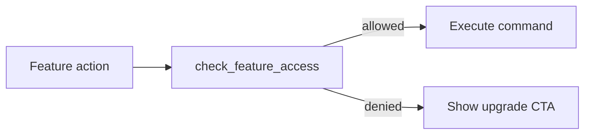

# Pro / VIP Tier System

**Last updated: July 2026**

## Overview

Pro and VIP tiers unlock executive features: event foresight, morale heatmap, custom departments, AI Co-CEO, executive lounge aesthetics, and hub-side benefits. Upgrades can use **NEAR wallet** flows when hub is configured.

---

## Implemented

| Feature | Status | Key paths |
|---------|--------|-----------|
| Tier state in AppState | ✅ | `tier/`, `state` company tier |
| Feature access check | ✅ | `check_feature_access` |
| Tier benefits listing | ✅ | `get_tier_benefits` |
| Upgrade tier (local) | ✅ | `upgrade_tier` |
| NEAR upgrade config | ✅ | `get_near_upgrade_config` |
| NEAR transaction sign | ✅ | `sign_near_transaction` |
| Claim NEAR upgrade | ✅ | `claim_near_tier_upgrade` |
| Open hub upgrade page | ✅ | `open_hub_upgrade_page` |
| $SOUL balance fetch | ✅ | `fetch_soul_balance` (hub) |
| VIP custom departments | ✅ | `create_custom_department` |
| AI Co-CEO | ✅ | `spawn_co_ceo`, briefing commands |
| Event foresight | ✅ | `get_event_foresight` |
| Morale heatmap | ✅ | `get_morale_heatmap` |
| Frontend tier panel | ✅ | Tier nav entry (v2) |
| NEAR wallet UI | ✅ | `services/nearWallet.ts` |

---

## Architecture

### Tier gating flow

### NEAR upgrade path (optional)

1. `get_near_upgrade_config` — chain + contract metadata
2. User signs via `@near-wallet-selector`
3. `claim_near_tier_upgrade` — desktop verifies and sets tier

Works only when hub/NEAR endpoints are reachable.

### VIP executive features

| Feature | Module |
|---------|--------|
| Co-CEO | `commands` co-ceo group |
| Custom departments | `departments/` |
| Foresight / heatmap | `fate/`, morale aggregates |

---

## Planned / Gaps

| Item | Notes |
|------|-------|
| Subscription billing (Stripe) | NEAR/hub path only |
| Tier downgrade flow | Upgrade-focused |
| Cross-device tier sync | Local tier + hub claim |
| Staking rewards UI | Documented in hub plan; limited desktop UI |

---

## Related docs

- [FINANCE_BUDGET.md](FINANCE_BUDGET.md)
- [AGENT_SYSTEM.md](AGENT_SYSTEM.md)
- [RANDOM_EVENTS.md](RANDOM_EVENTS.md)
- [docs/soulmd-hub/SOULMD_HUB_EXTENSION_PLAN.md](soulmd-hub/SOULMD_HUB_EXTENSION_PLAN.md)