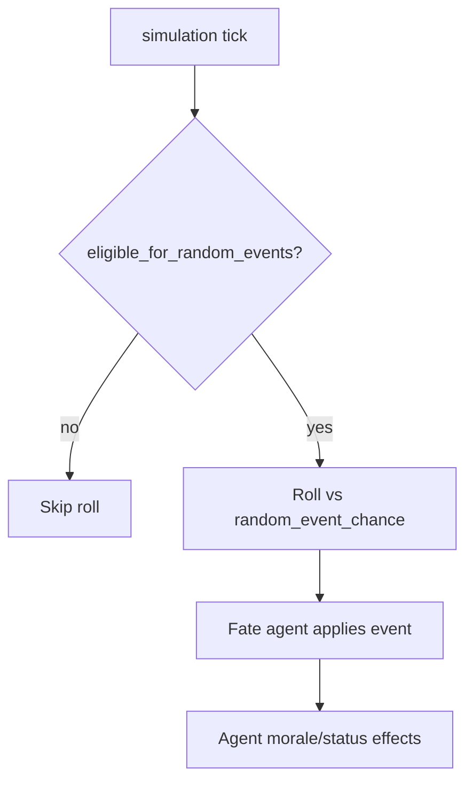

# Random Events & Play Modes

**Last updated: July 2026**

## Overview

Random events add drama via the **Fate** system agent when the company is in **Game** play mode with events enabled. **Serious Work Mode** (`PlayMode::Work`) automatically disables random events so productivity workflows are not interrupted.

---

## Implemented

| Feature | Status | Key paths |
|---------|--------|-----------|
| Fate system agent | ✅ | `fate/mod.rs`, `FATE_AGENT_ID` |
| Event eligibility check | ✅ | `eligible_for_random_events` |
| Event roll on simulation tick | ✅ | `fate/events.rs` |
| `random_events_enabled` setting | ✅ | `GameSettings` |
| `random_event_chance` tuning | ✅ | Clamped in fate module |
| Work mode auto-disable | ✅ | Sets `random_events_enabled = false` |
| Recent events API | ✅ | `get_recent_events` |
| Event foresight (VIP) | ✅ | `get_event_foresight` |
| Morale heatmap (VIP) | ✅ | `get_morale_heatmap` |
| God mode black swan | ✅ | `god_mode_black_swan` |
| Settings UI toggle | ✅ | `SettingsPanel` / game settings |

---

## Architecture

### Play modes

| Mode | Random events |
|------|---------------|
| `Game` | Allowed if `random_events_enabled` |
| `Work` | Forced off — Serious Work Mode |

### VIP foresight

`get_event_foresight` surfaces upcoming drama hints for Pro/VIP tiers without spoiling exact outcomes in the UI copy.

---

## Planned / Gaps

| Item | Notes |
|------|-------|
| Player-authored event packs | Built-in event table only |
| Department-specific event chains | Global rolls |
| Event replay gallery | Recent list only |
| Multiplayer synced events | Local simulation |

---

## Related docs

- [GOD_MODE.md](GOD_MODE.md)
- [AGENT_SYSTEM.md](AGENT_SYSTEM.md)
- [PRO_VIP_SYSTEM.md](PRO_VIP_SYSTEM.md)