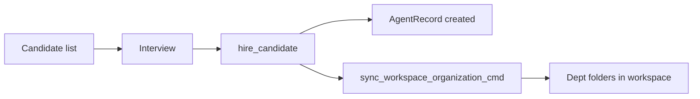

# Recruitment & HR

**Last updated: July 2026**

## Overview

**Recruitment** (CEO step 5) lets the CEO browse candidates, run interviews, and hire agents into departments. Hiring triggers **workspace org folder sync** and updates payroll projections. Optional hub integration can fetch marketplace souls; local candidates work offline.

---

## Implemented

| Feature | Status | Key paths |
|---------|--------|-----------|
| List candidates | ✅ | `list_recruitment_candidates` |
| Fetch candidate SOUL | ✅ | `fetch_recruitment_candidate_soul` |
| Record interview | ✅ | `record_recruitment_interview` |
| Hire candidate | ✅ | `hire_candidate`, `commands/recruitment.rs` |
| Recruitment analytics | ✅ | `get_recruitment_analytics` |
| Relationship graph | ✅ | `get_agent_relationship_graph` |
| Org folder sync on hire | ✅ | `sync_workspace_organization_cmd` |
| Auto-recruit (V1 ops) | ✅ | `operations/auto_recruit.rs` |
| God mode perfect hiring | ✅ | `god_mode_perfect_hiring` |
| Frontend Recruitment page | ✅ | `RecruitmentPage.tsx`, picker components |
| Candidate search/tags | ✅ | `data/recruitmentSearchTags.ts` |

---

## Architecture

### Hire flow

### Post-hire side effects

- Agent added to `AppState.agents` with department and salary
- Workspace folders created/updated under company root
- Token wallets initialized via `token_budget` bootstrap
- Relationship edges seeded for graph UI

### Analytics

`get_recruitment_analytics` returns funnel stats (views, interviews, hires) for the Recruitment panel KPIs.

---

## Planned / Gaps

| Item | Notes |
|------|-------|
| Hub marketplace candidate streaming | Local list + manual fetch |
| Interview LLM scoring rubric | Record notes only |
| Offer negotiation minigame | Fixed salary on hire |
| HR department automation policies | Auto-recruit basic rules only |

---

## Related docs

- [AGENT_SYSTEM.md](AGENT_SYSTEM.md)
- [WORKSPACE_FOLDERS_SYSTEM.md](WORKSPACE_FOLDERS_SYSTEM.md)
- [FINANCE_BUDGET.md](FINANCE_BUDGET.md)
- [GOD_MODE.md](GOD_MODE.md)