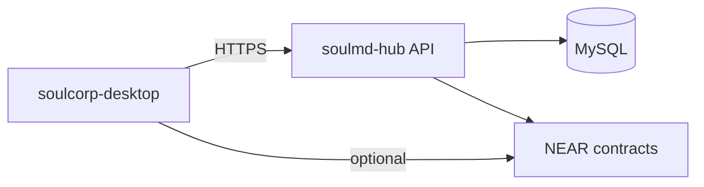

# soulmd-hub Extension Plan

**Last updated: July 2026**

## Overview

SoulCorp extends the existing **soulmd-hub** repo (PHP + MySQL + NEAR) for marketplace gigs, sync, and tier upgrades. The **desktop client is ahead of hub PHP** — gig lifecycle, sync commands, and NEAR wallet flows are implemented in `soulcorp-desktop`; hub controllers may still be partial.

**Target repo:** https://github.com/yanshekki/soulmd-hub

---

## Implemented (desktop side)

| Feature | Status | Key paths |
|---------|--------|-----------|
| Hub client module | ✅ | `src-tauri/src/hub/` |
| Sync command | ✅ | `sync_with_hub` |
| Gig CRUD + lifecycle | ✅ | `gigs/`, marketplace commands |
| $SOUL balance | ✅ | `fetch_soul_balance` |
| NEAR tier upgrade | ✅ | `claim_near_tier_upgrade`, wallet UI |
| Hub config in settings | ✅ | `update_hub_config` |

---

## Planned (hub PHP — reference schema)

The following remains the target hub schema; verify against live `hub/soulmd-hub` submodule before implementation.

### New tables (illustrative)

- `gigs` — marketplace postings
- `gig_assignments` — assignee + QC state
- `user_tiers` — Pro/VIP
- `sync_logs` — desktop sync audit

### New controllers (illustrative)

| Controller | Role |
|------------|------|
| `MarketplaceController` | Gig list/create/bid |
| `SyncController` | Desktop state pull/push |
| `FeeController` | Platform fee + NEAR |
| `VipController` | Tier checks |

### Economy (design intent)

- NEAR USDT + $SOUL
- 10% platform fee split (treasury / rewards / stakers)

---

## Integration diagram

---

## Planned / Gaps

| Item | Notes |
|------|-------|
| Full PHP controller parity | Desktop mocks or partial endpoints |
| WebSocket live market | Not implemented |
| Fee splitting smart contract | Design doc only |

---

## Related docs

- [NEW_API_ENDPOINTS_FOR_HUB.md](NEW_API_ENDPOINTS_FOR_HUB.md)
- [OFFLINE_FIRST_SYNC.md](../OFFLINE_FIRST_SYNC.md)
- [EXPORT_REAL_PRODUCTS.md](../EXPORT_REAL_PRODUCTS.md)
- [PRO_VIP_SYSTEM.md](../PRO_VIP_SYSTEM.md)